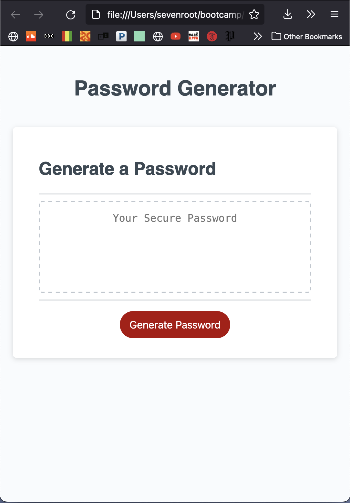

# Thrid Week Challenge -- Password Generator

UofO Bootcamp 3rd Week Challenge Exercise

## Usage

Using html, css, and javascript to create a password generating application: A prompt popup takes in parameters for the characters that the password will contain, receives inputs, and returns a password or 8 - 128 characters.

## Mockup

## Links
 
 <a href="https://github.com/SevenRooT/03_Challenge_PassWordGenerator" target="_blank">GitHub Repository</a>

 <a href="https://sevenroot.github.io/03_Challenge_PassWordGenerator/" target="_blank">Live Password Generator Page</a>

## License

[MIT](https://choosealicense.com/licenses/mit/)

